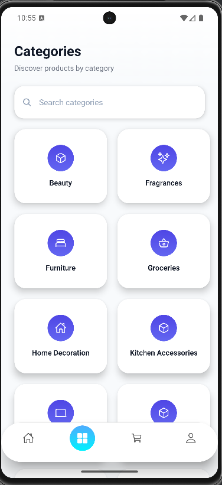
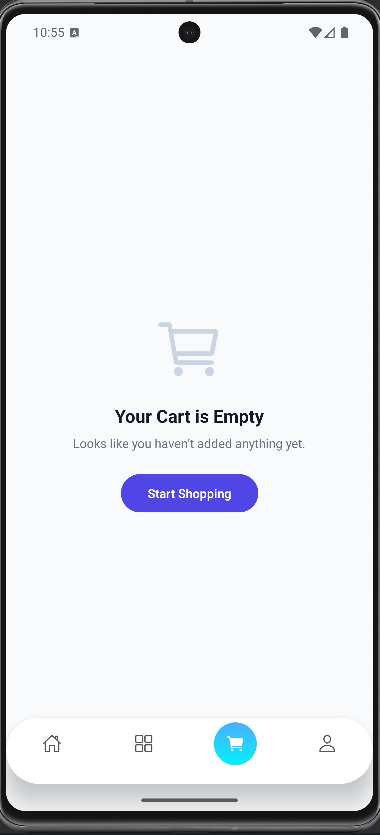

# ShopSphere 

A E-commerce mobile application built using **React Native + Expo Router**.

This app demonstrates real-world mobile architecture, API integration, reusable components, and premium UI design.

---

##  Screens

-  Home (Product Listing)
-  Categories (Search + Grid Layout)
-  Cart
-  Profile
-  Product Details

---

##  Features

- Dynamic product fetching using DummyJSON API
- Reusable ProductCard component
- Floating premium bottom navigation
- Category search functionality
- Dynamic routing with Expo Router
- Modern UI with gradients and shadows
- Clean project structure
- Proper Git commit history

---

##  Tech Stack

- React Native
- Expo
- Expo Router
- TypeScript
- React Hooks (useState, useEffect)
- Fetch API
- FlatList

---

## Project Structure

```
app/
 ├── (tabs)/
 │    ├── _layout.tsx
 │    ├── index.tsx
 │    ├── categories.tsx
 │    ├── cart.tsx
 │    └── profile.tsx
 │
 ├── product/
 │    └── [id].tsx
 │
 ├── category/
 │    └── [name].tsx
 │
components/
 ├── ProductCard.tsx
 └── Header.tsx
```

---

##  Run Locally

```bash
npm install
npx expo start
```

---

##  API Used

https://dummyjson.com/products

---
##  Screenshots

###  Home


###  Categories


###  Cart


---

##  Author

Akash Chavan  
GitHub: https://github.com/Akashchavan7
